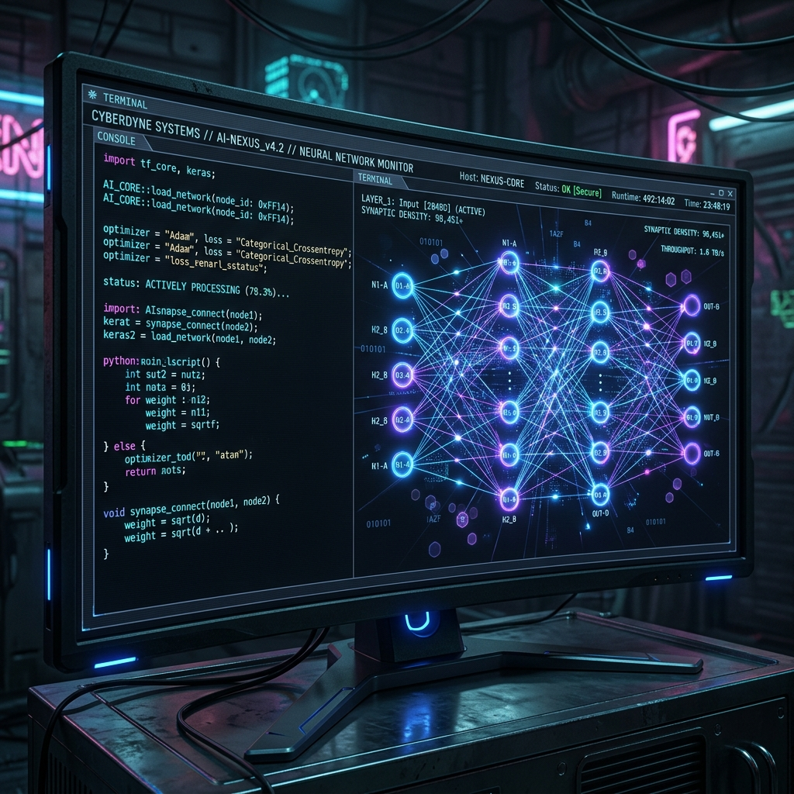

<!-- Typing Effect Title -->

<i>"If a task repeats, it should become a system."</i>

 

---

### 🟢 `whoami` -> The Identity Matrix

<table width="100%">
  <tr>
    <td width="40%" align="center" valign="middle">
      
    </td>
    <td width="60%" valign="top">
      <h3><code>psprosen-dev@github:~#</code></h3>
      <code>---------------------------------------</code> 
      <b>OS:</b> JarvisOS / Linux 
      <b>Host:</b> Android Termux (Local LLM Node) 
      <b>Kernel:</b> AI Automation Swarm 
      <b>Framework:</b> Antigravity (RTX⚡) Core 
      <b>Focus:</b> Multi-Agent Orchestration (MCP/ADK) 
      <b>Uptime:</b> 24/7 (n8n Workflows) 
      <b>Shell:</b> zsh / bash 
      <b>Role:</b> AI Automation Architect & Founder 
      <b>Company:</b> We Digital Mitra (WDM) 
      <code>---------------------------------------</code>
    </td>
  </tr>
</table>

---

### ⚔️ `ls /usr/bin/tech-stack`

  <b>Languages & Runtimes</b> 
  
  
  
  

  <b>AI & Agents</b> 
  
  
  
  

  <b>Automation & Ops</b> 
  
  
  
  

  <b>Dev Tools</b> 
  
  
  

---

### 📊 `top -o performance` -> GitHub Stats

  
   
  
   
  

---

### 🚀 Currently Building / Exploring

- 🧠 Expanding the **RTXCoreFramework** (Reasoning | Thinking | Xtreme) for absolute autonomous precision.
- ⚡ Developing master skills and **MCP (Model Context Protocol)** servers for Anthropic Claude & Google Agents CLI.
- 🕸️ Orchestrating complex data pipelines and LLM workflows via **n8n** and **Google ADK Graphs**.
- 🛠️ Perfecting the **Obsidian P.A.R.A / Zettelkasten** brain structure.

 

  

