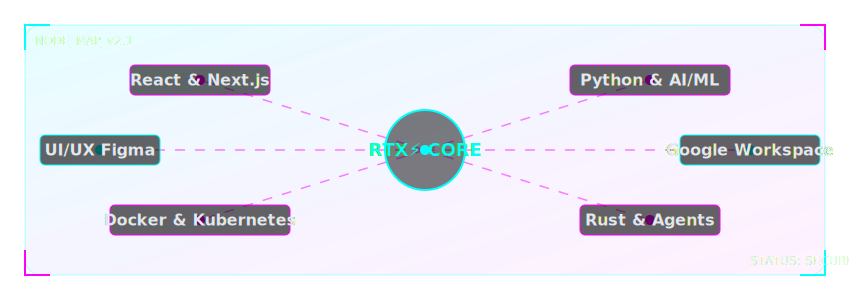

  <!-- BESPOKE CYBERNETIC HEADER WITH CSS ANIMATION -->
  

  <!-- ADVANCED ANIMATED TYPING WITH ENHANCED EFFECTS -->
  

<!-- NEON SOCIAL BADGES WITH HOVER GLOW EFFECT -->

  
  
  
  
  

 

  
  
  

 

<!-- HOLOGRAPHIC SEPARATOR -->

 

<!-- NEURAL INTERFACE SECTION WITH PULSE ANIMATION -->
<h2 align="center">
  
   CORE IDENTITY MATRIX 
  
</h2>

<!-- ENHANCED CYBERNETIC PROFILE WITH 3D ANIMATION -->
<table align="center" width="100%">
  <tr>
    <td width="60%" valign="top">
      
Welcome to my quantum grid! I'm <b>Ps Prosen</b> – a self-evolved coder, AI trailblazer, and digital marketing visionary from Panbari, Jalpaiguri, WB, India.

      
As the architect behind <b>We Digital Mitra</b>, I'm engineering a hyper-advanced digital ecosystem designed to revolutionize the online multiverse.

      
Think of me as a cybernetic Tony Stark – fusing code, innovation, and strategy into a single unstoppable force that's redefining digital frontiers!

      <h4>⚡ CORE SIGNATURES</h4>
      <ul>
        <li>🧠 Integrated <b>Jarvis (RTX⚡)</b> – AI Co-Pilot with R-T-X Protocols!</li>
        <li>🔮 Converting Limitations into Launch Sequences</li>
        <li>⚛️ Quantum-Level Problem Solving and Implementation</li>
        <li>🌌 Open-Source is my Superpower!</li>
      </ul>
    </td>
    <td width="40%" align="center" valign="middle">
      
    </td>
  </tr>
</table>

 

<!-- HOLOGRAPHIC KEY METRICS WITH ADVANCED VISUALIZATION -->

  <h3>
    
    HOLOGRAPHIC METRICS ENGINE
    
  </h3>
  
  
  

 

<!-- HOLOGRAPHIC SEPARATOR WITH ANIMATED PULSE -->

 

<!-- TECHNOLOGY MATRIX WITH ANIMATED SKILL ICONS - LANDSCAPE FORMAT -->

  <h2>
    
     TECHNOLOGY MATRIX 
    
  </h2>
  
  

    <!-- 3D GLASSMORPHISM NEURAL NODE MAP SVG -->
    
  

 

<!-- HOLOGRAPHIC SEPARATOR WITH ANIMATED PULSE -->

 

<!-- PROJECTS SHOWCASE WITH HOLOGRAPHIC ANIMATIONS -->
<h2 align="center">
  
   ACTIVE SIMULATIONS 
  
</h2>

  <table width="100%">
    <tr>
      <td width="50%" align="center">
        <h3>🌐 WE DIGITAL MITRA</h3>
        
        
<strong>A Cybernetic Digital Marketing Platform</strong>

        
Merging AI Analytics with Interstellar Outreach.

      </td>
      <td width="50%" align="center">
        <h3>⚡ JARVIS (RTX⚡)</h3>
        
        
<strong>An AI Co-Pilot Engine</strong>

        
Reasoning, Thinking, and Xtreme Execution Protocols.

      </td>
    </tr>
    <tr>
      <td width="50%" align="center">
        <h3>🧪 CODE FORGE</h3>
        
        
<strong>Repository of Futuristic Scripts</strong>

        
Python, JS, and Experimental AI Prototypes.

      </td>
      <td width="50%" align="center">
        <h3>🔮 NEURAL HORIZON</h3>
        
        
<strong>Edge of Human-Tech Symbiosis</strong>

        
Exploring the Frontier of Machine Intelligence.

      </td>
    </tr>
  </table>

 

  

 

<!-- ENHANCED CONTACT SECTION -->

  <h3>
    
    TRANSMISSION COORDINATES
    
  </h3>
  
  

    
    
    
  

  
   

  <h3 style="color:#00FFFF;">📡 NEURAL LINK ESTABLISHED...</h3>
  
<i>"The Future isn't Coming – I'm Coding it Now!"</i> – Ps Prosen

  <h2>Visit my digital command center → <a href="https://psprosen.me" target="_blank">psprosen.me</a></h2>

<!-- DYNAMIC GRADIENT FOOTER WAVE -->

